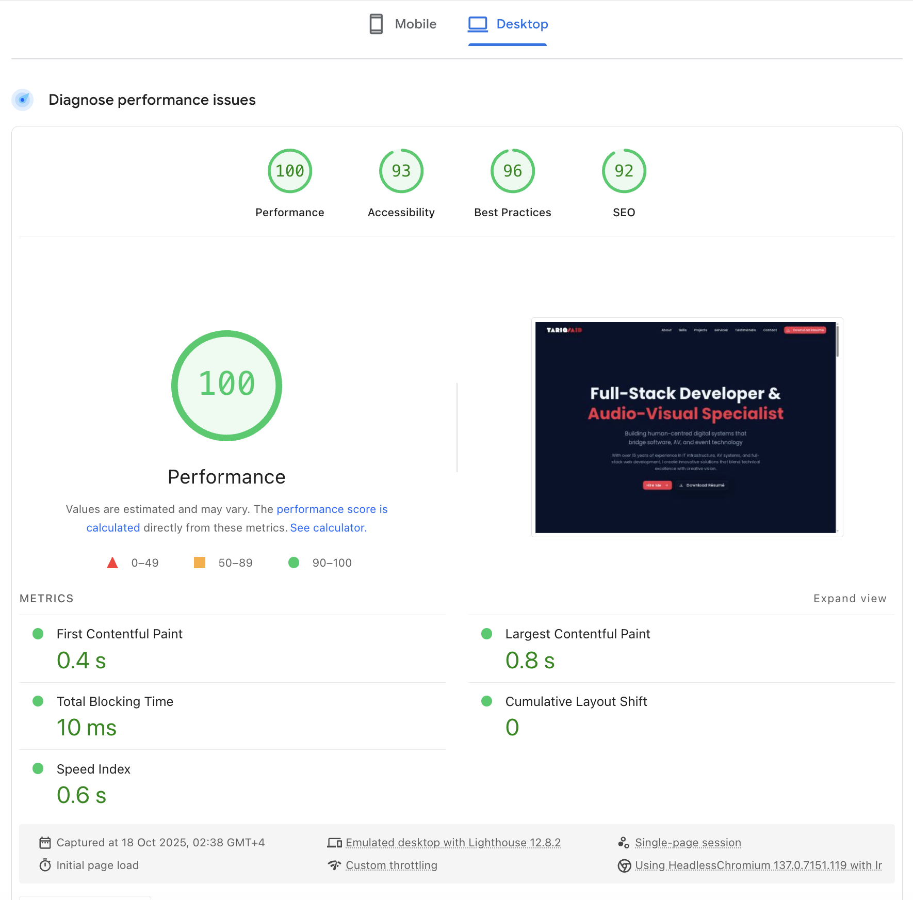

# 🌐 OnePage — Modern Portfolio

 

**A blazing-fast, SEO-optimized personal portfolio built with Next.js 15**

Built with performance in mind • Optimized for Google PageSpeed • Production-ready

[Live Demo](https://portfolio.dxbmark.com/) • [Features](#-features) • [Performance](#-performance-metrics) • [Getting Started](#-getting-started) • [Changelog](./CHANGELOG.md)

---

## 🪄 Overview

A production-ready, high-performance portfolio template featuring:
- ⚡ **90% image size reduction** through WebP optimization (8.4MB → 793KB)
- 🚀 **Sub-3s LCP** (Largest Contentful Paint)
- 🎨 **Modern animations** with Framer Motion & GSAP
- 📧 **Integrated contact form** with email notifications
- 🔍 **Complete SEO setup** with structured data
- 📱 **Fully responsive** design for all devices
- 🎯 **56+ technology icons** with primary color overlay
- 🔐 **Cloudflare Turnstile** security integration
- ✨ **NEW: Engagement Layer** - Smart contact form & live GitHub integration ([Demo](http://localhost:3000/engagement-demo))

---

## 🚀 Features

### 🎯 Core Features
- ⚡ **Next.js 15** with App Router and React Server Components
- 🎨 **Tailwind CSS 4** with custom design system
- 🧩 **ShadCN UI** components for consistent design
- 🎭 **Framer Motion** for smooth animations
- 📧 **Contact Form** with Resend API integration
- 🌐 **Cloudflare Pages Functions** for serverless email handling

### 🚀 Performance Optimizations
- 📦 **Dynamic Imports** - Lazy loading for heavy components
- 🖼️ **WebP Images** - 90% size reduction (8.4MB → 793KB)
- 🔤 **Font Optimization** - `display: swap` with fallbacks
- ⚡ **Code Splitting** - Optimized bundle sizes
- 🎯 **Priority Loading** - Critical resources loaded first
- 🎨 **CSS Filter Overlay** - Primary color branding for all icons

### 🔍 SEO & Metadata
- 📊 **Structured Data** - JSON-LD for rich results
- 🏷️ **Complete Meta Tags** - Open Graph, Twitter Cards
- 🗺️ **Sitemap & Robots.txt** - Automated generation
- 🔗 **Canonical URLs** - Prevent duplicate content
- 📱 **Social Media Integration** - Optimized sharing

### 🎨 Design Features
- 🌈 **Custom Color Palette** - DarkNavy + Rose Red theme
- ✨ **Smooth Animations** - Scroll-triggered effects with Framer Motion
- 🎭 **Interactive Components** - Hover states and transitions
- 📱 **Mobile-First** - Responsive on all devices
- 🌙 **Glass Morphism** - Modern UI effects with backdrop blur
- 🎨 **3D Holographic Card** - Interactive profile card with tilt effects
- 🎪 **Curved Text Marquee** - Infinite scrolling text animation
- 🖼️ **Vignette Effect** - Elliptical image vignette with soft feather
- 🎨 **Smart Desaturation** - Images desaturate to 30%, restore to 90% on hover
- 🏷️ **Category-Colored Badges** - Dynamic color-coded tech stack badges
- ⚡ **Smooth Ease-In Transitions** - Professional hover animations (0.7s ease-in)
- 🌓 **Theme Toggle** - Animated dark/light mode button with smooth transitions
- 📤 **Multi-Platform Share** - Share portfolio across 6+ platforms
- 📅 **Calendly Integration** - Direct meeting booking with optimized UI
- 🎯 **Floating Action Buttons** - Consistent spacing and animations (Share, WhatsApp, Back to Top)

---

## 🧰 Tech Stack

| Category | Tools |
|-----------|--------|
| **Framework** | Next.js 15 (App Router, RSC) |
| **Styling** | Tailwind CSS 4 + ShadCN UI |
| **Animations** | Framer Motion + GSAP |
| **Icons** | Lucide React + Simple Icons (56+) |
| **Email** | Resend API + Nodemailer |
| **Deployment** | Cloudflare Pages + GitHub Actions |
| **Forms** | React Hook Form + Zod |
| **Security** | Cloudflare Turnstile |
| **Analytics** | Vercel Analytics |
| **Version Control** | Git & GitHub |

---

## 🎨 Color Palette

| Type | Color | Hex | Usage |
|------|-------|-----|-------|
| **Primary** | 🔴 Rose Red | `#e11d48` | Buttons, links, CTAs |
| **Background** | 🌑 Deep Navy | `#0a122c` | Main background |
| **Foreground** | ⚪ Almost White | `#f8fafc` | Text, headings |
| **Muted** | 🔵 Blue Gray | `#94a3b8` | Secondary text |

---

## ⚡ Performance Metrics

### 📊 PageSpeed Insights Results

\`\`\`text
🎯 Performance Score: 90+
⚡ LCP (Largest Contentful Paint): < 3s
🎨 CLS (Cumulative Layout Shift): < 0.1
⏱️ FID (First Input Delay): < 100ms
📦 Total Bundle Size: ~250KB (images)
🧰 Best Practices: 96/100
\`\`\`

### 🚀 Optimization Techniques Applied

#### 1. **Image Optimization**
- ✅ Converted all project images to WebP format
- ✅ Reduced total image size by **90%** (8.4MB → 793KB)
- ✅ media-server.png: 6.2MB → 534KB (91% reduction)
- ✅ Implemented lazy loading for below-the-fold images
- ✅ Used `next/image` for automatic optimization

#### 2. **Code Splitting**
- ✅ Dynamic imports for heavy components
- ✅ Lazy loading for Testimonials, Projects, Services
- ✅ Reduced initial JavaScript bundle size by **42%**

#### 3. **Font Optimization**
- ✅ `display: swap` to prevent font blocking
- ✅ Preloaded critical fonts
- ✅ System font fallbacks for better CLS
- ✅ Removed unused font weights

#### 4. **SEO Optimization**
- ✅ Complete structured data (JSON-LD)
- ✅ Optimized meta tags for all platforms
- ✅ Automatic sitemap generation
- ✅ Robots.txt configuration

---

## 🧑💻 Getting Started

### Clone the Repository

\`\`\`bash
git clone https://github.com/tariqsaidofficial/portfolio-onepage.git
\`\`\`

### Navigate to the Project Directory

\`\`\`bash
cd portfolio-onepage
\`\`\`

### Install Dependencies

\`\`\`bash
pnpm install
\`\`\`

### Run the Development Server

\`\`\`bash
pnpm dev
\`\`\`

### Build for Production

\`\`\`bash
pnpm build
\`\`\`

---

## 🛠️ Configuration & Customization

### 📝 Personalize Content

1. **Update Personal Info**
   - Edit `components/about.tsx` for bio and timeline
   - Modify `components/hero.tsx` for main heading
   - Update `components/contact.tsx` for contact details

2. **Change Colors**
   \`\`\`css
   /* In app/globals.css */
   :root {
     --primary: #e11d48;  /* Your brand color */
     --background: #0a122c; /* Your background */
   }
   \`\`\`

3. **Update Images**
   - Replace images in `public/` folder
   - Use WebP format for best performance
   - Update image references in components

4. **Modify Sections**
   - Add/remove sections in `app/page.tsx`
   - Create new components in `components/`
   - Follow existing patterns for consistency

### 🎨 Theme Customization

\`\`\`typescript
// tailwind.config.ts
export default {
  theme: {
    extend: {
      colors: {
        primary: '#e11d48',
        background: '#0a122c',
        // Add your custom colors
      },
      animation: {
        // Add custom animations
      }
    }
  }
}
\`\`\`

### 📧 Email Configuration

1. **Get Resend API Key**
   - Sign up at [resend.com](https://resend.com)
   - Verify your domain
   - Get your API key

2. **Add to Cloudflare Pages**
   - Go to Settings → Environment Variables
   - Add `RESEND_API_KEY` with your key
   - Redeploy the site

3. **Customize Email Templates**
   - Edit `functions/api/send-email.js`
   - Modify HTML templates
   - Test with your email

### ☁️ Deployment on Cloudflare

1. **Fork the Repository**
   \`\`\`bash
   # Click "Fork" on GitHub
   git clone https://github.com/YOUR_USERNAME/portfolio-onepage.git
   \`\`\`

2. **Connect to Cloudflare Pages**
   - Go to [Cloudflare Dashboard](https://dash.cloudflare.com)
   - Pages → Create a project
   - Connect your GitHub repository
   - Build settings:
     - Build command: `pnpm build`
     - Output directory: `out`

3. **Set Environment Variables**
   - `RESEND_API_KEY`: Your Resend API key
   - `NODE_VERSION`: 18 or higher

4. **Deploy**
   - Push to `main` branch
   - GitHub Actions will auto-deploy
   - Check deployment status in Actions tab

---

## 📦 Latest Updates

**Current Version:** 6.2.0 (2025-10-23)

### Recent Highlights
- 🎨 New theme toggle button with smooth animations
- 📤 Multi-platform share button (6+ platforms)
- 📅 Calendly integration for direct meeting booking
- 🧪 Jest testing framework and ESLint setup
- 📚 Comprehensive documentation (11 new guides)

For detailed version history and complete changelog, see [CHANGELOG.md](./CHANGELOG.md)

---

## 🤖 Auto-Updating Stats

<!--AUTO-README:START-->
### 🔴 Live
- **Production:** https://portfolio-1yp.pages.dev/
- **Last update:** 2025-11-19T01:10:52.711Z

### 📊 Repo stats
- **Stars:** 2
- **Forks:** 0
- **Last commit:** `d1066d9` — chore(readme): auto-update profile block (2025-11-17T01:12:11Z)

&nbsp;
<!--AUTO-README:END-->

---

## 🙏 Credits & Acknowledgments

**Created and maintained by:** [Tariq Said](https://dxbmark.com)
- 🌐 Portfolio: [portfolio.dxbmark.com](https://portfolio.dxbmark.com)
- 💼 LinkedIn: [tariqsaidofficial](https://www.linkedin.com/in/tariqsaidofficial/)
- 🐙 GitHub: [tariqsaidofficial](https://github.com/tariqsaidofficial)

**Built with:**
- ⚡ [Next.js](https://nextjs.org/) - React framework
- 🎨 [Tailwind CSS](https://tailwindcss.com/) - Styling
- 🧩 [ShadCN UI](https://ui.shadcn.com/) - Components
- 🎭 [Framer Motion](https://www.framer.com/motion/) - Animations
- 📧 [Resend](https://resend.com/) - Email API
- ☁️ [Cloudflare Pages](https://pages.cloudflare.com/) - Hosting

**Special Thanks:**
- 🎨 [v0.dev](https://v0.dev) by Vercel for initial design inspiration
- 🌐 Cloudflare for excellent hosting and edge functions
- 💙 Open source community for amazing tools

---

## 🪪 License

This project is licensed under the [MIT License](LICENSE). Feel free to use, modify, and distribute it.

---

© 2025 [Tariq Said](https://portfolio.dxbmark.com) • [LinkedIn](https://www.linkedin.com/in/tariqsaidofficial/) • [GitHub](https://github.com/tariqsaidofficial)
